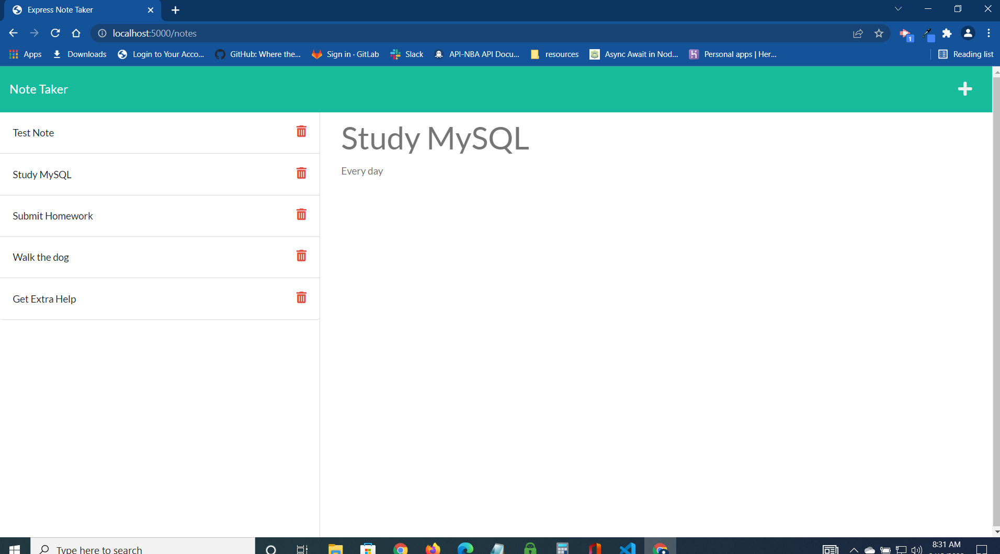

# Express-Note-Taker
## Description
A Node.js application that save notes so that the user can organize their thoughts and keep track of tasks they need to complete.
  ## Table of Contents
* [Installation](#installation)
* [Usage](#usage)
* [Features](#features)
* [Technology](#technology)
* [License](#license)
* [Screenshot](#screenshot)
* [Repository](#repository-httpsgithubcomdpmurphy11express-note-taker)
* [Deployed Application](#deployed-application-httpspeaceful-scrubland-40027herokuappcom)
* [Questions](#questions)
## Installation
  To install the project dependencies, run the following command from the depo root:
  ```
  npm i
  ```
## Usage
  To run the program, enter the following command:
  ```
  node server.js
  ```
## Features
```md
WHEN the user opens the Note Taker, THEN they are presented with a landing page with a link to a notes page
WHEN the user clicks on the link to the notes page, THEN they are presented with a page with existing notes listed in the left-hand column, plus empty fields to enter a new note title and the note’s text in the right-hand column
WHEN the user enters a new note title and the note’s text, THEN a Save icon appears in the navigation at the top of the page
WHEN the user clicks on the Save icon, THEN the new note they have entered is saved and appears in the left-hand column with the other existing notes
WHEN the user clicks on an existing note in the list in the left-hand column, THEN that note appears in the right-hand column
WHEN the user clicks on the Write icon in the navigation at the top of the page, THEN they are presented with empty fields to enter a new note title and the note’s text in the right-hand column
WHEN the user clicks on the Delete icon in the left column of the page, THEN that not is deleted from the backend and the page is rebuilt without that note
```
## Technology
```md
* VSCode terminal
* Node.js
* Heroku
* HTML
* CSS
* JavaScipt
* Template literals
* JavaScript modules
* Async writeFile
* Express Node Package
* UUID Node Package
* Path JS Package
* FS JS Package
* Bootstrap
* FontAwsome
```
### License 
[](https://github.com/dpmurphy11/Express-Note-Taker/blob/main/LICENSE)
### Screenshot

### Repository: <https://github.com/dpmurphy11/Express-Note-Taker>
### Deployed Application: <https://peaceful-scrubland-40027.herokuapp.com/>
### Questions
  If you have any questions about the repo, open an issue or contact me at dpmurphy_onsite@hotmail.com
  Visit my GitHub profile at [dpmurphy11](https://github.com/dpmurphy11/).